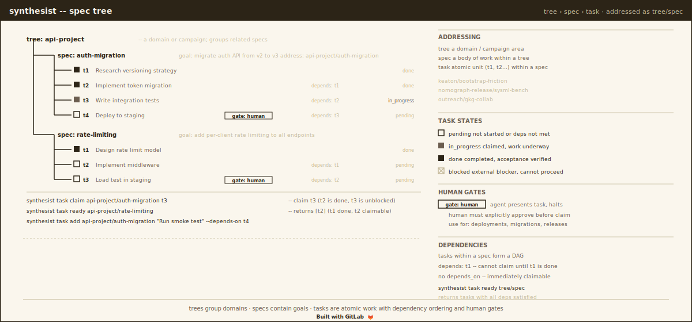
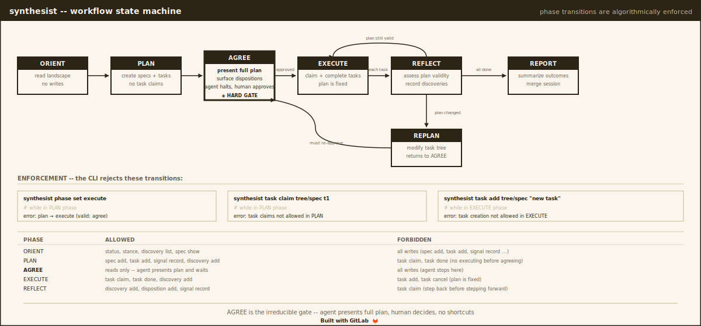

# Synthesist

[](https://gitlab.com/nomograph/synthesist/-/pipelines)
[](LICENSE)
[](https://gitlab.com/nomograph/synthesist)

Specification graph manager for AI-augmented collaborative development.
Claim-based storage over an append-only CRDT log.

## What it is

AI coding agents produce technically correct contributions that get
rejected. Studies of agent-authored pull requests find that a third of
rejections are driven by workflow constraints -- scope violations,
architectural misalignment, process expectations -- not code quality.
The agent wrote correct code for the wrong context.

The missing context is not about code. It is about the process that
governs the code: what has been planned, what has been agreed, what
has already been tried. Synthesist records this process as a graph of
specifications and tasks, annotated by phase, session, and discovery.

In v2, every piece of workflow state is a **claim** in a shared,
bi-temporal, append-only log. Multi-user collaboration merges
automatically via CRDT. Full supersession history is preserved per
field. Observation-layer data (stakeholders, dispositions, signals,
topics) has moved to the companion tool
[`lattice`](https://gitlab.com/nomograph/lattice).

Named for the role aboard the *Theseus* in Peter Watts' *Blindsight* --
the crew member whose job is not expertise, but coherence.

## Install

### mise

```toml
[tools."http:synthesist"]
version = "2.0.0"

[tools."http:synthesist".platforms]
macos-arm64 = { url = "https://gitlab.com/api/v4/projects/80084971/packages/generic/synthesist/v{{version}}/synthesist-darwin-arm64", bin = "synthesist" }
linux-x64 = { url = "https://gitlab.com/api/v4/projects/80084971/packages/generic/synthesist/v{{version}}/synthesist-linux-amd64", bin = "synthesist" }
```

### Source

```bash
git clone https://gitlab.com/nomograph/synthesist.git
cd synthesist && make build
```

Requires Rust 1.88+. No system dependencies beyond a C compiler.

## Spec Tree



## Quickstart

Synthesist is an LLM-mediated tool. The human interacts with an LLM
agent; the agent interacts with synthesist. The human never calls
synthesist directly. The LLM reads state, builds a shared mental
model, presents plans, obtains approval, executes work, and reports
results. The binary enforces structure on this process.

```bash
synthesist init                           # writes claims/genesis.amc
synthesist session start work             # appends a Session claim
export SYNTHESIST_SESSION=work

# Orient: read the landscape
synthesist --force phase set plan
synthesist status

# Plan: model the work
synthesist spec add upstream/auth --goal "Migrate auth API v2 to v3"
synthesist task add upstream/auth "Research versioning strategy"
synthesist task add upstream/auth "Implement migration" --depends-on t1
synthesist task add upstream/auth "Write tests" --depends-on t2 --gate human

# Agree: present to human, wait for approval
synthesist phase set agree

# Execute: do the work in dependency order
synthesist phase set execute
synthesist task claim upstream/auth t1
synthesist task done upstream/auth t1
synthesist task ready upstream/auth    # shows t2 is now unblocked

# Report and close
synthesist phase set report
synthesist session close work
```

## Storage model

Synthesist v2 stores all workflow state as **claims** -- typed,
timestamped, content-addressed assertions -- inside a `claims/`
directory at the repo root:

```
claims/
  genesis.amc           # git-tracked, bootstrap
  changes/<hash>.amc    # git-tracked, content-addressed, append-only
  config.toml           # git-tracked, schema version
  snapshot.amc          # gitignored, local compaction cache
  view.sqlite           # gitignored, local SQL cache of current state
  view.heads            # gitignored, heads-stale check
```

The claim log is the source of truth. `view.sqlite` is a local cache
rebuilt from the log on demand; delete it freely. Every update is
recorded as a new claim that *supersedes* a previous one -- nothing is
overwritten, the full history is preserved per field.

Multi-user writes merge automatically via CRDT (Automerge under the
hood). There is no `session merge` step anymore.

See the [`nomograph-claim`](https://gitlab.com/nomograph/claim) crate
for substrate details: storage API, E2EE, view rebuild, session
semantics, and the 16-claim-type schema.

## Migration from v1

Existing v1 repositories store state in `.synth/main.db` (SQLite). A
one-shot migration tool reads that database and writes equivalent
claims to `claims/`, preserving original `created_at` timestamps as
`asserted_at`:

```bash
# Dry run first
synthesist migrate v1-to-v2 --from .synth/main.db --to claims/ --dry-run

# Real run
synthesist migrate v1-to-v2 --from .synth/main.db --to claims/
```

v2.1 folded the earlier standalone `migrate-v1-to-v2` binary into this
subcommand; there is no separate executable to install.

Migration is idempotent; re-running on an already-migrated repo is a
no-op. After migration completes and you have verified the new
`claims/` directory, the old `.synth/main.db` can be deleted.

Observation data (stakeholders, dispositions, signals, topics) is
*not* migrated by this tool -- those claim types live in `lattice`
now, which has its own import path.

## Workflow State Machine



LLM agents left unconstrained skip planning and proceed directly to
code generation. The workflow state machine enforces a different
pattern with algorithmic enforcement -- the CLI rejects operations
that violate the current phase.

| Phase | What happens | What is forbidden |
|-------|-------------|-------------------|
| ORIENT | Read status, read discoveries. Build a shared mental model. | All writes. |
| PLAN | Create specs and tasks, define dependencies, research. | Task claims. No executing before agreeing. |
| AGREE | Present the plan. State assumptions. Halt and wait for human approval. | All writes. The agent stops. |
| EXECUTE | Claim and complete tasks in dependency order. | Task creation or cancellation. The plan is fixed. |
| REFLECT | After each task, assess: does the plan still hold? Record discoveries. | Task claims. Step back before stepping forward. |
| REPLAN | Modify the task tree. Returns to AGREE -- the human must re-approve. | Task claims. Changed plans need fresh consent. |
| REPORT | Summarize outcomes, record institutional memory, close the session. | -- |

The critical property is AGREE. The agent presents its full plan,
identifies which tasks need human gates, and waits. The human may
approve, reject, or reshape.

Phase transitions are validated:

```
synthesist phase set execute
# error: invalid phase transition: plan -> execute (valid: agree)
```

In v2, **phase is per-session**, recorded as a Phase claim scoped to
the active session. Concurrent sessions can be in different phases
without interfering.

## Sessions

Sessions tag writes so the origin of every claim is recoverable.
Unlike v1, sessions are *not* separate database files -- they are a
lightweight claim-tagging convention layered on top of the single
shared claim log.

```bash
synthesist session start research         # appends a Session claim
export SYNTHESIST_SESSION=research        # or --session=research on each command
# ... work ...
synthesist session close research         # appends a supersession closing the session
synthesist session list                   # show active sessions
```

There is no `session merge` or `session discard`. CRDT merges happen
automatically when claims land in the shared log; unresolved
supersession conflicts surface via `synthesist conflicts`.

## Command Reference

| Area | Commands |
|------|----------|
| Estate | `init`, `status`, `check`, `version`, `skill`, `serve` |
| Trees | `tree add`, `tree list` (`--include-closed`), `tree show`, `tree close` (`--start-id`) |
| Specs | `spec add`, `spec show`, `spec update`, `spec list` (positional or `--tree`) |
| Tasks | `task add`, `task list`, `task show`, `task update`, `task claim`, `task done`, `task reset`, `task block`, `task wait`, `task cancel`, `task ready`, `task acceptance` |
| Discoveries | `discovery add`, `discovery list` |
| Campaigns | `campaign add`, `campaign list` |
| Sessions | `session start`, `session close` (`--start-id`), `session list`, `session status` |
| Phase | `phase show` (alias `phase get`), `phase set` |
| Data | `export`, `import`, `sql`, `conflicts`, `migrate status`, `migrate v1-to-v2` |

`synthesist serve` (new in this version) opens a local HTTP dashboard
for browsing the claim graph. Defaults to `127.0.0.1:5179`. The page
is server-rendered HTML with a push-based refresh: a filesystem
watcher on `claims/changes/` drives an SSE stream, so the browser
reflects new claims without reload and without timed polling. Two
views: trees (the spec/task hierarchy) and network (a d3-force layout
of trees, specs, sessions, and tasks). Pass `--bind-all` to expose
it on the LAN for cross-machine review.

Observation-layer commands (`stakeholder`, `disposition`, `signal`,
`topic`, `stance`, `landscape`) have moved to
[`lattice`](https://gitlab.com/nomograph/lattice). Running them on
v2 synthesist prints a pointer to the replacement.

## The Skill File

`synthesist skill` outputs the complete behavioral contract: data
model, workflow state machine, command reference with worked examples,
error handling, and display conventions. This is the primary interface
for LLM agents. It is execution-system agnostic -- works with Claude
Code, Cursor, or any framework that gives an LLM shell access.

## Building

```bash
make build    # release binary
make test     # integration tests
make lint     # clippy -D warnings
make skill    # emit skill file
```

## License

MIT. See [LICENSE](LICENSE).
