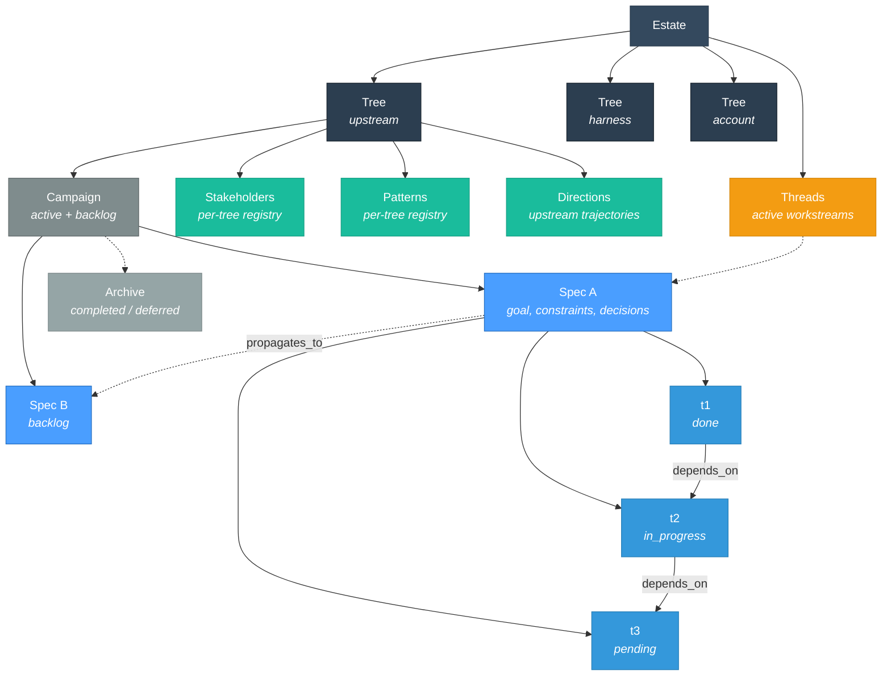
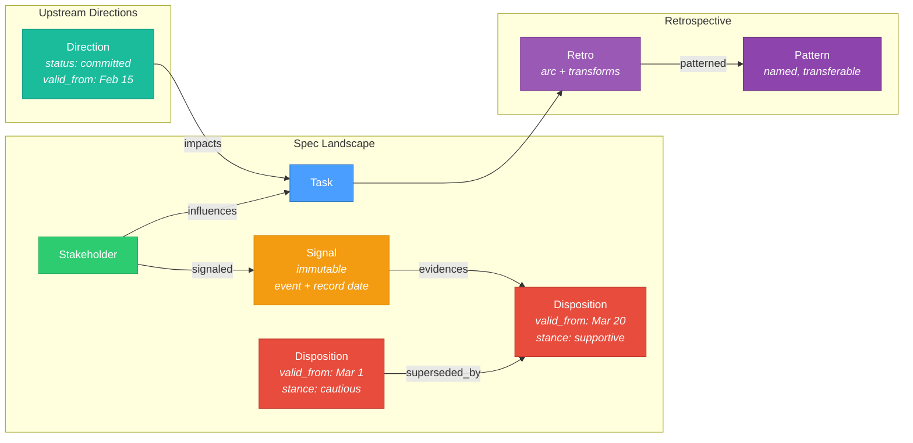
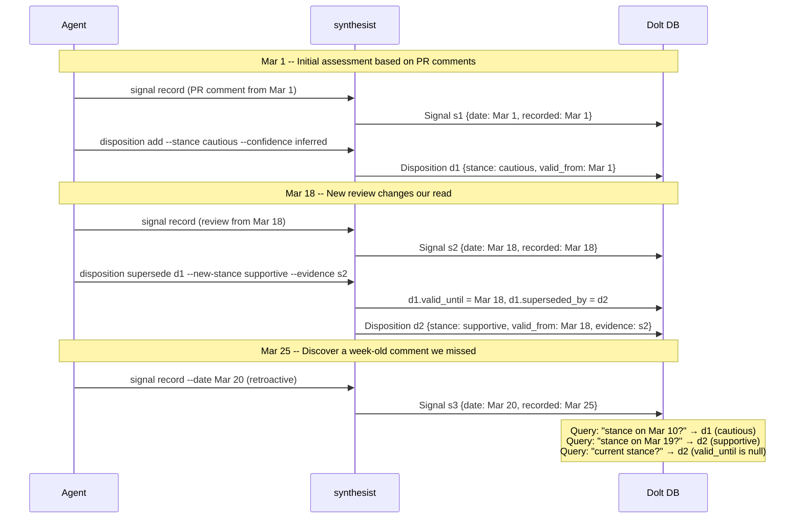

# Synthesist

A specification graph manager for AI-augmented projects. Synthesist is a Go binary
with an embedded Dolt database that tracks task DAGs, stakeholder intelligence,
temporal dispositions, and retrospective patterns. LLM agents interact exclusively
through CLI commands -- they never read or write data files directly.

Named for the role aboard the *Theseus* in Peter Watts' *Blindsight* -- the one
crew member whose job isn't expertise, but coherence.

## Install

### mise (recommended)

```toml
# .mise.toml
[tools]
"ubi:nomograph/synthesist" = { version = "latest", exe = "synthesist", provider = "gitlab" }
```

### Build from source

```bash
git clone https://gitlab.com/nomograph/synthesist.git
cd synthesist
make build    # requires Go 1.26+, CGo, and ICU (see Building section)
make install  # installs to $GOPATH/bin
```

## Quick Start

```bash
# Initialize in your project
cd your-project
synthesist init

# Create a spec with goal and constraints (tree/spec format)
synthesist spec create upstream/auth-service \
  --goal "Migrate auth API from v2 to v3" \
  --constraints "Backward compatible. No breaking changes to existing clients."

# Add tasks to the spec
synthesist task create upstream/auth-service "Research API versioning strategy"

# Track a stakeholder and their disposition
synthesist stakeholder add upstream mwilson --context "auth-service maintainer"
synthesist disposition add upstream/auth-service mwilson \
  --topic "API versioning" --stance cautious --confidence inferred

# Work through the task DAG
synthesist task claim upstream/auth-service t1
# ... do the work ...
synthesist task done upstream/auth-service t1

# See the full estate overview
synthesist status
```

All output is JSON by default. Use `--human` for human-readable output.

## Data Model

### Structure

The estate is a hierarchy. Trees organize work by domain. Specs are
units of work within a tree. Tasks form a DAG within a spec.
Campaigns track what's active and what's waiting.



### Intelligence

Each spec has a landscape: who influences the work, what they've
signaled, and our assessment of their stance. Dispositions and
directions are temporal -- they have validity windows and form
supersession chains.



### Temporal model

Dispositions and directions have validity windows. Signals are
bi-temporal (event time vs record time). When evidence changes an
assessment, the old record is superseded -- not deleted. The full
history is preserved and queryable.

This diagram shows how a disposition evolves as new signals arrive:



Key properties:
- **Dispositions** are never deleted, only superseded. Full history queryable by date.
- **Signals** are immutable and bi-temporal. `date` is when the event happened.
  `recorded_date` is when we captured it. This matters for retroactive discovery.
- **Directions** follow the same temporal model. An upstream trajectory that moves
  from `proposed` to `committed` creates a new direction record; the old one is
  superseded.
- **`synthesist stance <person>`** resolves the current disposition (valid_until is null).
  **`synthesist stance <person> <topic>`** returns the full supersession chain.

### Node reference

| Node | Scope | Temporal | Description |
|------|-------|----------|-------------|
| **Estate** | global | -- | Top-level switchboard. Lists trees and active threads. |
| **Tree** | estate | -- | Domain of work (upstream, harness, account). |
| **Campaign** | tree | -- | Active and backlog specs within a tree. |
| **Spec** | tree | created | Unit of work with goal, constraints, and decisions. Contains task DAG and landscape. |
| **Thread** | estate | date | Active workstream pointer. Pruned after 7 days if idle. |
| **Task** | spec | created, completed | DAG node with acceptance criteria. Status: pending, in_progress, done, blocked, waiting. |
| **Retro** | spec | created, completed | Task node (type=retro) with arc, transforms, pattern links. |
| **Stakeholder** | tree | -- | Human actor. Identity registered once per tree. |
| **Signal** | spec | date, recorded_date | Immutable evidence. Bi-temporal: event time vs record time. |
| **Disposition** | spec | valid_from, valid_until | Temporal stance assessment. Supersession chains preserve history. |
| **Direction** | tree | valid_from, valid_until | Upstream technical trajectory. Supersedable. Impacts linked to specs. |
| **Pattern** | tree | first_observed | Named reusable approach. Referenced by retro nodes across specs. |
| **Archive** | tree | archived | Completed/deferred spec record with duration, patterns, contributions. |

### Edge reference

| Edge | From | To | Description |
|------|------|----|-------------|
| `depends_on` | task | task | Execution ordering within a spec DAG |
| `provenance` | task | task | "While doing X we discovered Y" (cross-spec) |
| `influences` | stakeholder | task | Who affects whether this work lands |
| `evidences` | signal | disposition | What evidence supports this assessment |
| `supersedes` | disposition | disposition | Temporal replacement (also direction -> direction) |
| `impacts` | direction | spec | Which specs an upstream trajectory affects |
| `patterned` | retro | pattern | Named approach identified during retrospective |
| `observed_in` | pattern | spec | Where a pattern has been applied |
| `propagates_to` | spec | spec | "When this spec changes, target needs updates" (ordered) |

## The Skill File

`synthesist skill` outputs the complete LLM behavioral contract -- the full
command reference, rules, and usage patterns. This is the primary interface
documentation for agents.

Install it into any LLM harness by referencing the skill output in your agent
instructions:

```bash
# For Claude Code -- add to AGENTS.md or CLAUDE.md:
# "Run synthesist skill for the full command reference"

# For OpenCode -- create a skill file:
synthesist skill > .opencode/skills/synthesist/SKILL.md

# For any other agent framework:
synthesist skill >> your-agent-config
```

The tool is agent-agnostic. It works with Claude Code, OpenCode, Cursor, or any
framework that gives an LLM access to shell commands.

## Architecture

### Dolt embedded database

The Dolt database lives at `.synth/synthesist/.dolt/` inside the consuming project.
Dolt is an embedded SQL database with git semantics -- content-addressed storage,
branch/merge on data, and table-level diffing.

```
your-project/
├── .synth/                    # Dolt database (created by synthesist init)
│   └── synthesist/.dolt/      # Database files
├── AGENTS.md                  # or CLAUDE.md -- tells agent to use synthesist
└── ...
```

### Why not JSON files?

v1-v4 stored all state as JSON files that LLM agents read and wrote directly. This
worked for simple task DAGs but broke down with temporal stakeholder intelligence.
Temporal queries across flat JSON files require loading everything and reconstructing
relationships in memory. LLMs writing raw JSON are trusted to produce valid state
transitions with no enforcement layer.

### Why not SQLite?

SQLite would require a separate JSON projection layer for git tracking. Dolt
eliminates this by being both the database and the version-controlled artifact.
`synthesist diff` shows table-level changes between commits without an external
diffing tool.

### Git-tracked .synth/ directory

The `.synth/` directory is tracked in git. When the binary writes data, it commits
to both the Dolt internal history and the outer git repository. Other contributors
pull the database as part of normal `git pull`. The tradeoff: `git diff` on `.synth/`
is binary, but `synthesist diff` provides richer table-level diffs.

### Binary owns all writes

The `synthesist` binary is the single write path to the database. This enforces:

- Valid state transitions (a task can only go `pending -> in_progress -> done`)
- Referential integrity (a disposition must reference an existing stakeholder)
- Temporal consistency (superseding a disposition sets `valid_until` and creates the replacement atomically)
- Automatic git commits on state changes (configurable with `--no-commit`)

LLMs produce better results when constrained to well-formed operations (Yegge,
Beads 2026). A CLI with typed commands prevents invalid states and handles
computation LLMs are bad at -- temporal resolution, graph traversal, date math.

## Key Design Decisions

**Why Dolt over TerminusDB?** TerminusDB is graph-native with better traversal,
but requires running a server. Synthesist needs an embedded database that compiles
into a single binary.

**Why a binary at all?** A CLI with typed commands provides a stable API that
decouples storage format from agent interface. Invalid state transitions are
impossible. The binary handles things LLMs are bad at (date math, temporal
queries, referential integrity checks) so agents can focus on what they're good
at (reasoning over context, making implementation decisions).

**Why temporal dispositions?** The delta between proposed implementation and what
a maintainer will accept is the real cost of upstream contributions. Disposition
tracking models that delta so agents make informed choices instead of contributing
blind. The temporal model preserves history -- when a maintainer changes their
mind, we can see the arc.

**Why retrospective replay?** Retro nodes with labeled transforms enable "play
back this work onto a different project." An agent reads the transforms (what moves
were made and why), checks the landscape (what stakeholder constraints shaped
choices), and generates a new spec adapted for the target context. This is the
Synthesist's core competency -- making work transferable.

**LLM simulation methodology.** Synthesist embodies a simulation approach to LLM
tool design: constrain the agent to well-formed operations, handle computation
externally, and let the agent focus on reasoning. This aligns with the Beads
framework (Yegge 2026) for structured agent interactions, the Graphiti/Zep
approach to temporal knowledge graphs, and the Howard & Matheson framing of
decision analysis as structured information flow.

## Building

### Prerequisites

- **Go 1.26+** with CGo enabled
- **ICU libraries** (required by Dolt):
  - macOS: `brew install icu4c@78` (or `brew install icu4c`)
  - Linux: `apt-get install libicu-dev` (Debian/Ubuntu) or `dnf install libicu-devel` (Fedora)

### Build commands

```bash
make build      # Build the binary (./synthesist)
make test       # Run all tests
make install    # Install to $GOPATH/bin
make lint       # Run go vet
make check      # Build + run synthesist check against local specs
make dev        # Build + show help
make skill      # Build + output the LLM skill file
make release    # Cross-compile for darwin/arm64, darwin/amd64, linux/amd64, linux/arm64
```

The Makefile auto-detects ICU on macOS via Homebrew and sets the correct
`CGO_CFLAGS`, `CGO_CXXFLAGS`, and `CGO_LDFLAGS`.

## Version History

See [CHANGELOG.md](CHANGELOG.md) for the full history. Brief summary:

- **v5** (2026-03-28) -- Dolt embedded storage, Go CLI binary, temporal specification graphs
- **v4** (2026-03-27) -- Concurrent session support with active threads
- **v3** (2026-03-21) -- Context trees, estate switchboard, campaign coordination
- **v2** (2026-03-18) -- Single primary agent, campaigns, concurrent sessions
- **v1** (2026-03-15) -- Spec format, agent roles, executable acceptance criteria

## Sources and Influences

Synthesist combines ideas from agent memory systems, temporal knowledge
graphs, decision theory, open source social dynamics, and specification
frameworks. No single prior system unifies task execution with
stakeholder intelligence. The contribution is the combination.

### Task DAGs and agent memory

**[Beads](https://github.com/steveyegge/beads)** (Yegge, 2026) --
git-backed, Dolt-powered task tracker for AI agents. 19.9k stars. Typed
relationships (`relates_to`, `duplicates`, `supersedes`, `dep`), agent
queries via `bd ready --json`. Core insight we adopted: "markdown plans
cost the model GPU cycles to parse; structured, queryable,
dependency-aware data is cheaper and more reliable." Beads tracks
*tasks*. We extend this to track *people*.

**[Gastown](https://github.com/steveyegge/gastown)** (Yegge, 2026) --
multi-agent workspace orchestrator built on Beads. Validated Dolt
embedded as a storage backend for agent coordination. Design principle
we adopted: "findings survive context death." Our retrospective nodes
and pattern registry exist because of this.

**[PlugMem](https://www.microsoft.com/en-us/research/blog/from-raw-interaction-to-reusable-knowledge-rethinking-memory-for-ai-agents/)**
(Microsoft Research, 2025) -- transforms raw agent interactions into
propositional knowledge (facts) and prescriptive knowledge (reusable
skills). Maps directly to our separation of signals (raw observations)
from dispositions (assessed stances) and patterns (transferable
approaches).

### Temporal knowledge graphs

**[Graphiti/Zep](https://github.com/getzep/graphiti)**
([arXiv:2501.13956](https://arxiv.org/abs/2501.13956)) -- bi-temporal
knowledge graph where every edge carries validity windows: when a fact
became true (event time) and when it was recorded (transaction time).
94.8% accuracy on Deep Memory Retrieval benchmark. We adopted the
bi-temporal model directly for dispositions and signals.

**Graph-based Agent Memory survey**
([arXiv:2602.05665](https://arxiv.org/abs/2602.05665), Feb 2026) --
comprehensive taxonomy: knowledge graphs for static facts, temporal
graphs for time-sensitive information, hierarchical structures for task
decomposition, hypergraphs for n-ary relations. Identifies "sentiment
memory" and "user profiling" as categories but has no taxonomy for
stakeholder dynamics in collaborative development. This gap is what we
fill.

**[MAGMA](https://arxiv.org/abs/2601.03236)** (2025) -- four
orthogonal graph structures (semantic, temporal, causal, entity) with
policy-guided traversal. We chose a simpler approach: a single
relational schema with temporal validity on specific node types. The
complexity tradeoff is deliberate -- our consumer is an LLM calling CLI
commands, not a graph reasoning engine.

### Influence and decision theory

**Howard & Matheson** ("Influence Diagrams", Decision Analysis, 2005;
[originally 1981](https://pubsonline.informs.org/doi/10.1287/deca.1050.0020))
-- introduced influence diagrams for the Defense Intelligence Agency to
model political conflicts in the Persian Gulf. Three node types
(decisions, uncertainties, values) with arcs representing informational
influence. Our disposition model borrows the framing: stakeholder stances
are uncertainties that influence contribution strategy decisions.

**Influence maximization on temporal networks**
([Applied Network Science, 2024](https://link.springer.com/article/10.1007/s41109-024-00625-3))
-- the order and timing of interactions matters; influence propagation
differs on time-varying networks versus static ones. This supports our
design decision to make dispositions temporal rather than static.

### Open source social dynamics

**Crowston et al.** ("Social network analysis of open source software",
[IST 2020](https://www.sciencedirect.com/science/article/abs/pii/S0950584920301956))
-- systematic review identifying the temporal gap: "information on how
these structures appear and evolve over time is lacking." Our disposition
supersession chains are a direct response.

**[GitHub Blog](https://github.blog/open-source/maintainers/what-to-expect-for-open-source-in-2026/)**
(2026) -- documents widening gap between participants and maintainers.
"The gap between the number of participants and the number of maintainers
with a sense of ownership widens as new developers grow at record rates."
Confirms the practical need for contributor-side context modeling.

### Strategic mapping

**[Wardley Maps](https://www.wardleymaps.com/read)** (Wardley, 2017)
-- evolution axis models how components change from genesis to commodity.
Our direction nodes serve a similar function at the project level:
tracking where an upstream technology is heading so contributors can
align rather than invest in paths that will be replaced.

**Asahara** ("Beyond Ontologies: OODA Loop Knowledge Graph Structures",
[2025](https://eugeneasahara.com/2025/03/14/beyond-ontologies-ooda-knowledge-graph-structures/))
-- connects Boyd's observe-orient-decide-act cycle to graph query
patterns. Resonates with our cycle: observe (signals), orient
(dispositions), decide (task strategy), act (contribution).

## License

MIT -- see [LICENSE](LICENSE).
