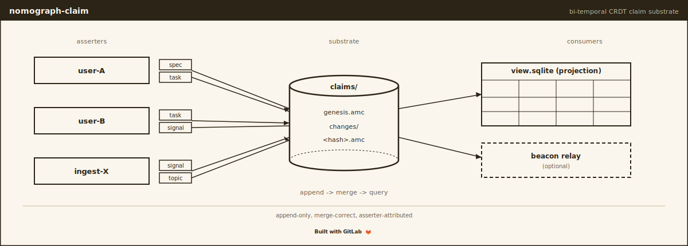

# nomograph-claim

[](https://gitlab.com/nomograph/claim/-/pipelines)
[](LICENSE)
[](https://gitlab.com/nomograph/claim)

Bi-temporal claim substrate: per-asserter JSON-LD logs with a redb
typed-query index.

## What it is

`nomograph-claim` is the storage primitive shared by every nomograph
tool that writes state: synthesist (workflow), lattice (observation),
seer (propagation). It gives each tool a set of per-asserter
append-only logs of typed assertions that merge losslessly by union,
preserve who asserted what when, and serve typed reads through a
disposable on-disk index.

The substrate is deliberately small, and vocabulary-agnostic: it
stores any well-formed claim and knows nothing about synthesist's
claim types. A claim is a typed, dated record of what someone asserts
to be true. Storage is a JSON-LD line log per asserter; the read path
is a redb-backed "gamma" index rebuilt from the union of those logs.

This is the v3 substrate. The v2 Automerge `.amc` store is gone; only
a minimal v2-read shim remains, used solely so the synthesist
v2-to-v3 migration can drain a legacy `.amc` estate.

## Install

This crate is a `[lib]`-only workspace member of the
[synthesist](https://gitlab.com/nomograph/synthesist) monorepo. It
ships no binary. Build it from the workspace root:

```bash
git clone https://gitlab.com/nomograph/synthesist.git
cd synthesist && cargo build --workspace
```

Requires Rust 1.88+. No system dependencies beyond a C compiler.

### Library (Cargo)

```toml
[dependencies]
nomograph-claim = "3.0.0-rc.2"
```

## Library use

```rust
use nomograph_claim::{Claim, /* ... */};

// Append a claim to the writing asserter's log, then read through the
// gamma index. ClaimType and per-type validation live in the consuming
// crate (e.g. synthesist); the substrate stores any well-formed claim.
```

The public surface centers on the per-asserter log writer/reader, the
gamma index, asserter/identity types, and the JSON-LD context. See the
module map below and the rustdoc (`cargo doc --no-deps --open`).

## Storage Layout

At project root, under `claims/`:

| Path | Tracked | Purpose |
|------|---------|---------|
| `<asserter>/log.jsonl` | yes | Per-asserter append-only JSON-LD log (the source of truth) |
| `_schema.json` | yes | Store schema version |
| `_view.gamma` | no | Disposable redb gamma index, rebuilt from the log union |

Each log line is a self-contained JSON-LD document: an inline
`@context` binding the `synthesist`, `nomograph`, `prov`, and `xsd`
prefixes, plus `@type`, `@id`, and lowerCamelCase predicate names. The
multi-user merge is the union of every asserter's log; there is no
merge step and no textual git conflict. `_view.gamma` is a local cache
keyed on the logs' heads; deleting it costs only a one-time rebuild.

## Architecture

The locked design lives in the keaton repo under
`research/graph-primitive/`:

- [`BUILDING.md`](https://gitlab.com/nomograph/keaton/-/blob/main/research/graph-primitive/BUILDING.md)
  -- locked decisions (D1-D20), claim schema, file naming.
- [`BUILDING-lever-principles.md`](https://gitlab.com/nomograph/keaton/-/blob/main/research/graph-primitive/BUILDING-lever-principles.md)
  -- LLM-correctness checklist for Rust implementors.
- [`BUILDING-pipeline-catalog.md`](https://gitlab.com/nomograph/keaton/-/blob/main/research/graph-primitive/BUILDING-pipeline-catalog.md)
  -- CI and container catalog.

In-tree, [`SYNC.md`](SYNC.md) covers the per-asserter log union, heads,
and the gamma rebuild boundary; [`IDENTITY.md`](IDENTITY.md) covers
asserter attribution.

## Module Map

| Module | Responsibility |
|--------|----------------|
| `claim` | Claim type, content-addressed id, supersession |
| `asserter` | Asserter identity and attribution |
| `log` | Per-asserter `log.jsonl` append + read |
| `jsonld` | JSON-LD `@context` and document (de)serialization |
| `gamma` | redb-backed POS/PSO typed-query index + canonical-doc table |
| `heads` | Per-log heads tracking; drives gamma rebuild |
| `ontology` | Embedded nomograph base ontology |
| `prov` | PROV attribution predicates |
| `store` | v2-read shim: drains legacy `.amc` for migration only |
| `error` | `thiserror`-derived error surface |

## Building

```bash
cargo build --release
cargo test
cargo clippy -- -D warnings
cargo doc --no-deps --open
```

## License

MIT. See [LICENSE](LICENSE).
